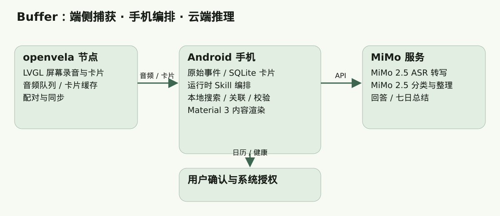
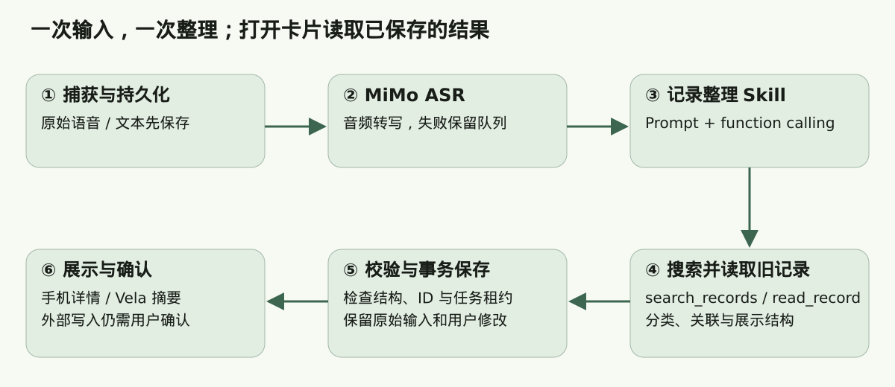

# Buffer：让念头先有地方住
## 2026 首届 openvela AI 硬件开发者大赛 · 技术报告

版本：2026-09-20，提交前核验稿。本文按官方作品提交模板第二节组织。当前演示方向为 openvela 模拟器与 Android 模拟器协同，Gemini S1 作为此前适配对象介绍，不以固件编译替代实机验收。

# 1、信息表

| 项目 | 内容 |
| --- | --- |
| 作品名称 | Buffer：个人认知缓冲区 |
| 队伍名称 | 待补充正式名称；赛事仓库标识为 makahu |
| 团队分工 | 待补充成员姓名与实际分工；开发涉及产品设计、Android、openvela、AI 编排、测试与演示 |
| 选题方向 | 拟选 AI 硬件产品创新；最终按实际报名信息填写 |
| 赛事仓库 | contest2026_014_makahu |
| 配套 Android 源码 | 本仓 foundation.fabric/apps/android/buffer-app（来源 https://github.com/6xingyv/foundation.fabric） |
| 当前验证方式 | Android 自动化测试、Vela C 主机回归测试、固件编译与部分 Android 模拟器界面检查 |

# 2、摘要

Buffer 面向灵感、疑问与待办频繁打断当前任务的场景，提供“先记录，稍后整理”的个人认知缓冲区。openvela 设备承担屏幕录音、离线缓存与卡片展示；Android 保存原始事件并编排 MiMo 2.5 ASR 和 MiMo 2.5，完成转写、分类、旧记录关联和回顾。运行时 Skill 将提示词、只读工具调用及结构化输出组合为一次整理流程，界面按 Material 3 组件呈现。已完成的测试基线包含 257 项 Android 单元测试和 16 个 Vela 主机测试脚本，均通过；真实模型效果与双模拟器完整闭环仍待验收。

# 3、正文

## 3.1 绪论

### 项目背景与问题定义

学习、写作和开发过程中，人会不断产生暂时无法处理的内容：一个小说设定、一个技术问题、明天要办的事，或者对身体状态的观察。如果立即展开，容易打断当前任务；如果只依赖记忆，又容易遗忘。普通记录入口往往要求先打开应用、选择列表、决定分类，保存后的内容也可能长期沉在列表底部。

Buffer 把“接住输入”和“决定怎么处理”分开。用户按住屏幕按钮说话，松开保存，也可以在手机输入文字。系统保留原始内容，再整理为灵感、问题、待办或生活记录。用户可稍后返回、补充研究笔记、关联旧想法，或在七日回顾中重新理解它们。

本作品属于效率与生活记录工具，不将生活提醒或模型生成内容表述为疾病诊断、治疗或已验证的健康干预。

### 技术难点

- 多端可靠捕获：音频接收、存储、上传、转写和分类是多个异步步骤，需要避免失败后丢失原始记录或产生重复卡片。
- 低算力节点分工：openvela 展示端负责输入、缓存与交互；较重的网络协议和 AI 工作流由手机承担。
- 模型输出约束：分类、关联关系和展示结构必须可校验，模型不能凭空引用不存在的记录或直接执行外部写入。
- 弱网与恢复：断网、无密钥、服务失败、迟到回包和用户修改都需要明确的状态与重试策略。
- 小屏交互：设备端应保留容易触达的录音入口，避免配对码、调试状态和大量操作按钮长期挤占主要内容。

### 创新点

一是把桌面 openvela 节点作为低摩擦语音入口，使手机成为整理中心。二是用“冷藏—回流—研究”的内容生命周期承接尚不适合立刻行动的想法。三是让运行时 Skill 在分类阶段主动检索旧记录，一次产出关联与详情结构，减少用户打开卡片后的等待。四是保留原始事件与用户确认边界，使 AI 整理结果可以被修正。

## 3.2 系统方案设计

### 总体架构与数据流

| 节点 | 系统与职责 | 数据边界 |
| --- | --- | --- |
| openvela 展示端 | NuttX/openvela、LVGL；屏幕录音、音频队列、卡片缓存、专注与睡前展示 | 保存本地待上传音频与展示数据，不持有模型 API Key |
| Android 手机端 | Android、Kotlin、Compose；本地事件库、配对通信、AI 工作流、日历及健康平台适配 | 保存原始 Capture、派生卡片、任务状态和加密配置 |
| MiMo 服务 | MiMo 2.5 ASR 转写；MiMo 2.5 分类、回答、整理和周总结 | 接收任务所需音频或文本；工具执行位置仍在手机 |

语音可以来自手机，也可以来自 Vela。手机录音原格式为 AAC/MP4，调用 ASR 前解码并封装为 WAV；Vela 音频为 PCM16 WAV。原始文件与转写结果分开保存，展示卡片可以调整，原始输入仍可追溯。

### 方案论证与选型

| 选择 | 采用理由 | 相比备选方案的取舍 |
| --- | --- | --- |
| openvela + LVGL | 适合已有设备图形、音频和网络能力接入 | 当前没有新建硬件驱动，重点在应用与协同体验 |
| 手机编排、云端推理 | 手机便于管理凭据、本地检索和系统授权；云端提供模型能力 | 相比全端侧推理依赖网络，但不要求展示端承载模型权重 |
| SQLite 事件与卡片视图 | 支持事务、任务恢复、关联查询和本地离线使用 | 尚未实现完整多主事件复制与 CRDT |
| 结构化组件渲染 | 模型决定内容组织，应用控制布局和交互 | 相比任意 HTML/代码生成，界面表达范围更明确、结果更易验证 |
| 双模拟器演示 | 降低刷机与驱动调试对演示的影响 | 不能代替真实麦克风、功耗、触摸与无线稳定性测量 |

断网时，Vela 继续保留音频队列和已缓存卡片；手机未转写音频保留在待处理入口，不混入收藏。模型不可用时不伪造 AI 回答或周总结。用户仍可查看已保存内容并手动补录转写。

### 通信与角色协同

已有局域网路径采用 UDP 发现、配对码确认与 TCP 绑定，配对后通过 NDJSON/TCP 上传录音、下发卡片和传回操作。BLE 添加设备路径包含配置分片、绑定回执与 Wi-Fi 配置能力；完整现场操作仍需端到端验证。

配对码只属于首次绑定流程。成功绑定后隐藏，短暂失联不会自动变回未配对；界面显示绑定和同步状态。模型 API Key 只保存在手机，经 Android Keystore 加密，不下发到 Vela。

产品规定 Coordinator 自动推选优先级为“手机 > Vela”。当前实际处理主路径由手机承担；自动选举、失联接替和恢复抢占尚未完整实现，本文不把固定手机路径等同于分布式选举完成。

## 3.3 核心算法与技术原理

### AI 模型与接口

| 能力 | 模型 / 机制 | 当前实现 |
| --- | --- | --- |
| 语音转写 | mimo-v2.5-asr | Chat Completions 的 input_audio；WAV data URL；language=auto |
| 分类与整理 | mimo-v2.5 | 结构化分类、只读 function calling、旧记录关联与展示结构 |
| 问题回答 | mimo-v2.5 | 生成简短答案，或保留 unanswered 状态 |
| 七日回顾 | mimo-v2.5 | 根据七日事实生成正文；不使用规则拼接正文替代模型总结 |
| 端侧辅助规则 | 状态机、输入验证与任务调度 | 不部署 ASR/LLM 权重，不涉及端侧模型量化或推理帧率 |

官方服务地址为 https://api.xiaomimimo.com/v1/chat/completions，支持 Bearer 鉴权。应用保留兼容服务配置入口。HTTP 返回成功不直接等于业务成功：仍检查响应完整性、字段类型、枚举、长度与关联引用。真实 MiMo 推理质量尚未通过标准音频集测量。

参考：小米 MiMo 语音识别接口文档 https://mimo.mi.com/docs/zh-CN/api/audio/Speech-Recognition；Chat Completions 文档 https://mimo.mi.com/docs/zh-CN/api/chat/openai-api。

### 分类、检索与状态保护

一次 Capture 可以拆成多个片段，但始终保留与原始输入的关系。分类输出限定为 Spark、Question、Task、Care、Weekly 等内部卡片类别。健康分类使用固定枚举，任意输出不能扩展成未实现的系统动作。

模型通过 search_records 查询本应用的标题、摘要、标签和研究笔记，再通过 read_record 读取候选旧记录。当前“旧项目”指 Buffer 中保存的项目草稿、研究主题和相关记录，不代表已经接入电脑目录、GitHub 项目或外部项目管理器。

工具只返回限定数量与长度的内容；单次整理最多 5 轮模型请求、8 次工具调用，每轮最多 4 次工具调用。最终关联 ID 必须来自工具已返回的真实记录，保存时再次检查记录存在性。模型返回的提示词和工具结果不能替代应用的权限与输入校验。

后台分类使用持久化任务与租约。分类、关联和展示结构在同一数据库事务内保存；事务失败整体回滚。若用户已编辑、确认或删除记录，迟到的分类响应不能覆盖该操作。

### openvela 系统能力运用

| 核心能力 | 使用的组件 | 本项目的具体工作 |
| --- | --- | --- |
| 图形 | LVGL、字体渲染、显示与输入适配 | 录音主按钮、卡片展示、状态提示与 Material 3 风格主题 |
| 多媒体 | 音频采集接口、ALSA 适配、PCM/WAV | 按住录音、松开保存、采集上限与离线音频队列 |
| AI 协同 | Vela 网络通信与手机侧 MiMo 编排 | Vela 发起输入，手机转写整理，再同步少量结果卡片 |
| 连接与存储 | Socket、BLE、Wi-Fi、文件系统 | 发现配对、分片配置、音频及卡片持久化、失败重试 |

优化包括将录音控制与保存从 LVGL 事件线程移到后台，避免线程等待卡住触摸响应；减少刷新栈上的大数组；使用小尺寸图标和有限卡片缓存。对平台的建议是完善官方模拟器音频输入示例、设备配网样例和跨设备状态诊断工具。

## 3.4 系统实现

### 软件与固件架构

Android 正按 data / domain / ui 重构。data 承担数据库、网络、设备协议与平台适配；domain 表达模型、规则和用例；ui 放置 Compose 页面、卡片组件与主题；应用入口负责初始化与依赖组装。此轮重构仍在进行，3.5 的测试基线指重构前已验证的 MiMo 功能版本，不代表重构后的最终验收结果。

Vela 应用位于 app/buffer_app：buffer_ui 负责 LVGL；buffer_audio 负责采集与 WAV；buffer_store 管理队列与绑定；buffer_wire 管理业务通信；pairing、BLE、enrollment 和 Wi-Fi 模块处理设备接入。屏幕录音请求由后台线程执行，不依赖实体按键设备。

### 关键流程

1. 用户按住录音按钮，松开后保存原始音频；手机文本输入可跳过 ASR。
2. Vela 音频进入待上传队列；手机接收后持久化，成功回执用于推进队列状态。
3. 手机调用 MiMo 2.5 ASR，完成后写入转写，失败保留音频并等待重试。
4. 触发记录整理 Skill，模型查找旧记录，统一生成分类、关联、建议与展示结构。
5. 校验结果，在同一事务中提交派生卡片及关联信息；保留原始 Capture。
6. 打开卡片时直接渲染已保存的结构，不因点击再发起同一轮整理请求。
7. 日历、健康等写入通过现有用户确认及平台授权流程执行；Vela 接收适合小屏展示的卡片摘要。

### 硬件与模拟器适配

此前面向 Gemini S1 / Allwinner R528 平台编译与适配应用；当前改用 openvela 模拟器和 Android 17 模拟器进行演示开发。没有新增外接模块、PCB 或 BOM，也没有宣称完成全新硬件平台移植或底层驱动开发。已有 S1 编译产物只证明编译链接，不证明刷机、麦克风或触摸效果。

Windows 官方 Vela 模拟器运行时曾验证版本为 32.1.15.0 / build 20250724。Android 使用 Android 17（API 37）模拟器；单元测试使用 Robolectric SDK 35。Vela 模拟器应用先前存在启动断言，当前没有完整双模拟器通信演示验收记录。

### 应用与交互设计

手机采用“此刻、收藏、回顾”三个主入口，设置和设备接入按需展开。收藏支持向右滑动编辑、向左滑动打开删除确认，以及长按多选。删除展示卡片会保留原始事件，并清理相关提醒和关联引用。

详情由模型产出的段落与列表块组织，使用固定 Material 3 组件、字体层级和配色渲染，不执行模型生成的代码。七日回顾先展示 AI 总结，再展示事实统计。Vela 使用 LVGL 实现与 Material 3 一致的颜色角色、圆角卡片和大触摸目标；录音使用官方 Material Symbols Rounded 图标。

### 自定义运行时 Skill：Buffer Capture Organizer

本项目将运行时 Skill 定义为“触发条件 + Prompt + function calling 工具 + 输出契约 + 提交规则”的完整任务能力。它由手机编排，在文本保存或语音转写完成后触发，职责是把一次输入整理成可回顾、可关联、可处理的卡片。

| Skill 元素 | 定义 |
| --- | --- |
| 输入 | 原始转写、允许的健康分类、当前输入身份 |
| Prompt | 分类、旧记录检索、事实与建议区分、不得编造已执行动作、结构化输出约束 |
| search_records(query) | 在本应用历史内容中检索，最多返回 12 条候选，排除待转写输入 |
| read_record(card_id) | 读取本轮搜索已返回的记录，补充摘要、研究笔记和状态 |
| 输出 | segments、related_card_ids、presentation.blocks；保留原始片段关系 |
| 展示约束 | 每段最多 6 个块；支持 paragraph/list；标题、正文及条目有长度上限 |
| 写入约束 | 工具本身只读；模型结果校验后由手机事务保存；外部写入仍需确认 |
| 失败路径 | 无配置或请求失败保留任务；非法结构或未知关联被拒绝；过期响应不覆盖用户数据 |

当前 Skill 的实际承载为 Android 代码中的 Prompt、工具 Schema 和执行循环。本文附件给出其可读规格。赛事模板提到的 /data/agent/skills/ 目录加载方式尚未接通；不能将“已有运行时 Skill 逻辑”表述为“已经部署 openvela 目录加载器”。本次已将同一规格归档至仓内 data/agent/skills/，按要求不接入调用。

## 3.5 系统测试与结果分析

### 测试环境与证据口径

测试基线截点为 2026-09-20 22:23 左右的 Android MiMo 功能版本；当晚后续 data/domain/ui 重构未纳入该基线。测试数量取自 JUnit XML，Vela 结果来自 tests/test_*.py 实际运行，不将主机测试称为实机测试。

| 项目 | 实际结果 | 边界 |
| --- | --- | --- |
| Android 单元测试 | 257 项，失败 0，错误 0 | Robolectric / JVM；不等于真实云服务效果验证 |
| Android 构建与 Lint | assembleDebug、lintDebug、testDebugUnitTest 通过；一次增量任务耗时 33 秒 | 构建耗时不是推理时延，后续重构需重新验证 |
| Vela 主机回归 | 16 个脚本全部通过 | 包含触摸录音请求、配对、缓存、协议、恢复和计时 |
| S1 固件编译 | 已通过 | 仅历史适配与编译证据；当前交付转向模拟器 |
| Android 模拟器 | 应用曾安装启动，设置页已检查；侧滑获用户反馈正常 | 不代替全部页面和新版本验收 |
| MiMo HTTP 契约 | 回环测试校验 ASR 音频封装、模型名、Bearer 与文本解析 | 尚无真实 MiMo 识别准确率 / 时延数据 |
| 双模拟器完整闭环 | 待验收 | 需同屏展示输入、同步、转写、关联和卡片回传 |

### 功能与可靠性验证

已验证的重点包括：待转写音频不进入收藏；编辑冲突与删除防复活；过期分类租约隔离；七日总结任务持久化与事务回滚；关联及展示结构保存后重新打开数据库仍可读取；配对报文边界、超时与身份校验；缓存提交失败、重试和选中卡片保持；网络阻塞期间专注计时仍推进；触摸快速点按、重复按下、连续录音与退出保护。

模型语义错误不等于传输失败。对于错误分类、错误关联或不可靠答案，产品提供原始内容回溯、编辑和人工确认；对于无有效转写或格式错误，保留待处理状态。尚未建立统计意义上的 ASR 测试语料与人工标注集，不能填入识别准确率、误报率或漏报率。

### 参数与性能数据

| 指标 | 数值 / 状态 | 类型 |
| --- | --- | --- |
| Vela 音频采样 | 16 kHz、单声道、PCM16 WAV | 实现配置 |
| Vela 默认单次录音上限 | 8 秒，可配置 1–30 秒 | 默认参数，不是时延测试 |
| Vela 默认离线队列 | 8 条 | 容量配置 |
| Vela 默认音频文件上限 | 512 KiB | 容量配置 |
| 手机单次录音上限 | 30 秒，原始录音文件上限 512 KiB | 实现配置 |
| 记录整理调用预算 | 最多 5 轮模型请求、8 次工具调用 | 应用限制 |
| ASR 字错率 / 分类准确率 | 未测，待固定样本集与人工标注 | 不提供估算值 |
| 云端 P50 / P95 时延 | 未测，待真实接口调用采样 | 不以 HTTP Mock 耗时代替 |
| 功耗、RAM 峰值、界面 FPS | 未测 | 不以固件文件大小代替资源占用 |
| 连续稳定运行时长 | 未形成完整测量记录 | 不以模拟器窗口存活代替稳定性结论 |

下一轮验收使用固定的中文、夹杂英文、多人/噪声和静音样本；记录输入到卡片落库的耗时、失败恢复次数与人工评分。模拟器阶段先完成流程与异常验证，再评估是否进行实物资源与功耗测量。

## 3.6 AI-Native 开发说明

| 指标 | 数据与口径 |
| --- | --- |
| AI Coding 代码占比 | 待依据最终 diff 和真实开发日志统计，当前不填未经核验的百分比 |
| 使用的 AI 工具 | Codex 主代理；用户指定的 Luna High 子代理用于 Android 分层整理 |
| MCP / 工具使用 | 工具化终端、源码检索、构建测试、浏览官方文档；未使用 Figma 或 VelaJS MCP 的实际证据，不列入成果 |
| Skills 使用与新增 | 运行时记录整理 Skill：Prompt、function calling 与结构化输出；开发中使用官方文档检索辅助接口核对 |
| Token 使用总量 | 待查询真实会话与 MiMo 控制台，不以估算冒充统计 |

AI 主要辅助产品拆解、协议实现、Compose/LVGL 页面、异常路径分析和回归测试。有效的协作方式是把业务目标落实为可检查的输入输出约定，再用真实代码与测试纠正生成结果。

开发中也暴露了问题：连续追加功能导致入口类和数据库类过大；示例接口与真实 MiMo ASR 格式不一致；编译通过曾被误当作运行效果充分。对应措施是进行 data/domain/ui 分层、核对官方音频输入契约，并将编译、主机测试、模拟器检查和实机验收分开记录。

赛事仓库 logs/ 当前可见示例目录，正式 AI Coding 日志仍需按赛事工具导出。本文不生成、改写或伪造开发日志；提交前必须确认真实日志覆盖最终代码与主要 AI 协作过程。

## 3.7 总结与展望

### 成果总结

Buffer 已建立原始输入、派生卡片、离线缓存和手机 AI 编排的实现基础；MiMo ASR 与整理接口完成代码接入及回环验证，收藏管理、回顾任务和多项故障恢复具备自动化测试。当前重点是完成 Android 分层后的验证与双模拟器演示闭环。

### 应用前景与商业价值

目标受众是经常跨任务思考的学生、开发者、研究者和创作者，尤其适合愿意用语音低成本记录、又不希望立即进入任务管理流程的用户。桌面展示端与手机结合，可以作为个人效率工具，也可拓展到研究笔记、写作素材和日常复盘。

潜在商业模式包括基础本地功能免费、用户自备模型密钥，以及后续经过验证的托管同步或硬件套件。当前没有用户规模、付费转化或收入数据；规模化前需测量留存、有效回顾率、云服务成本与隐私接受程度。

### 不足与后续工作

- 完成 data/domain/ui 重构并重新运行构建、Lint、全部测试与模拟器启动检查。
- 完成 Vela 模拟器可见界面、音频输入与 Android 通信闭环，录制不超过五分钟的真实演示视频。
- 补齐真实 MiMo 效果、时延、持续运行和异常恢复测量。
- 运行时资源已归档到 data/agent/skills/；部署及加载机制按本次要求暂不启用。
- 完成手机优先的 Coordinator 自动选举、多设备事件复制与更完整的加密业务通道。
- 统一赛事仓库的 Android 依赖获取与编译说明，保证评委 clone 后可按明确步骤复现。

# 附录 A：提交材料核对

| 材料 | 当前状态 | 提交前操作 |
| --- | --- | --- |
| 技术报告 DOCX | 本文已按模板编写 | 补齐正式队名、成员、最终测试数据后定稿 |
| 演示视频 ≤5 分钟 | 尚未交付 | 录制真实双端操作与 MiMo 能力，不能用静态图替代功能演示 |
| 实物照片 | 当前改用模拟器 | 如最终展示硬件实物，则补相应多角度照片 |
| 海报、答辩 PPT | 尚未制作 | 按入围 / 线下展示要求准备 |
| 源码与依赖 | Vela 与 Android 分仓 | 补齐赛事仓库可复现获取、构建流程与版本标识 |
| AI Coding 日志 | 正式日志待确认 | 使用赛事规定工具导出；不手工修改日志内容 |
| 提交压缩包 | 尚未生成正式提交包 | 按“队伍名称-Buffer-contest2026_014_makahu.zip”命名 |

# 附录 B：源码与参考

- 产品需求：docs/app.md；接口与职责：docs/buffer_phone_openvela_docs.md。
- 既往审计与测试证据：docs/audit_report.md、docs/functional_completion_review.md、tests/。
- Android 源码：foundation.fabric/apps/android/buffer-app；本报告证据基线见随附 evidence.json。
- Material Design 3：https://m3.material.io/；Material Symbols：https://developers.google.com/fonts/docs/material_symbols。
- 小米 MiMo ASR：https://mimo.mi.com/docs/zh-CN/api/audio/Speech-Recognition。
- 小米 MiMo Chat Completions：https://mimo.mi.com/docs/zh-CN/api/chat/openai-api。
- Windows openvela 模拟器：https://github.com/open-vela/prebuilts_emulator_windows-x86_64。
